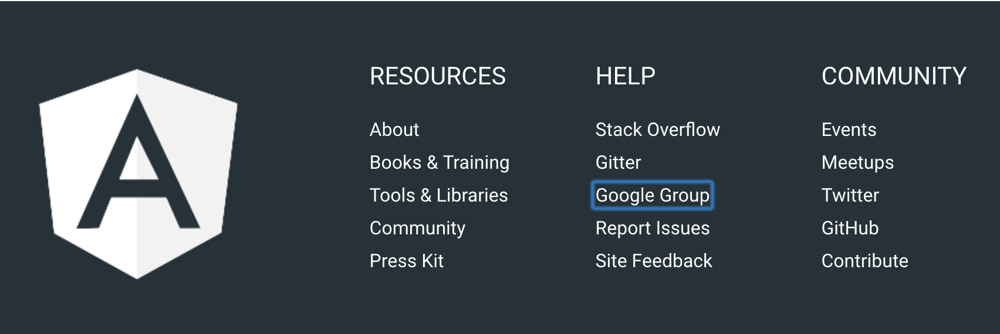

# Keyboard Accessibility

Keyboard accessibility is the ability of your application to be interacted with using just a keyboard. The more streamlined the site can be used this way, the more keyboard accessible it is. Keyboard accessibility is one of the largest aspects of web accessibility since it targets both those with motor disabilities who can't use a mouse, blind users who typically prefer to navigate websites with their keyboard and those who prefer not to use a mouse.


## Page focus

Keyboard interaction is driven by something called *page focus*. In web applications only one element has page focus at a time, and keypresses are done using that element as the main point of context. This element can be accessed programmatically through the `document.activeElement` DOM method and visually, this is often represented by a glowing border surrounding the rendered element.




### Tabbing

The most common way of moving focus along the page is through the `tab` key. By default, elements will be traversed in the order they appear in the document markup, so that order must be carefully considered during development. By default, only links, buttons and form controls can receive keyboard focus. There may be cases where you'll want to change the default behaviour, this can be done through the `tabindex` attribute. The `tabindex` can be given the values:
  - *less than zero* - to let readers know that an element should be focusable but not keyboard accessible
  - *0* - to let readers know that that element should be accessible by keyboard
  - *greater than zero* - to let readers know the order in which the focusable element should be reached using the keyboard. Order is calculated from lowest to highest.


### Transitions

The majority of transitions that happen in an Angular 2 application will not involve a page reload. This means that developers will need to carefully manage what happens to focus in these cases. It's important that if some action involves a transition away from the natural page flow, then page focus should be handled as well. Modals are one example of this:

```
@Component({
  selector: 'ngc2-modal',
  template: `
    <div
      role="dialog"
      aria-labelledby="modal-title"
      aria-describedby="modal-description">
      <div id="modal-title">{{title}}</div>
      <p id="modal-description">{{description}}</p>
      <button (click)="close.emit()">OK</button>
    </div>
  `,
})
export class ModalComponent {
  constructor(private modal: ModalService, private element: ElementRef) { }

  ngOnInit() {
    this.modal.visible$.subscribe(visible => {
      if(visible) {
        setTimeout(() => {
          this.element.nativeElement.querySelector('button').focus();
        }, 0);
      }
    })
  }
}
```
[View Example](https://plnkr.co/edit/Vvu62nDZ18IkqiAop2A9?p=preview)

In this example, we see that when the modal becomes visible, the `OK` button immediately receives focus. This streamlines the experience for keyboard users or screen readers to match the experience given to mouse userse or those without screen readers.
